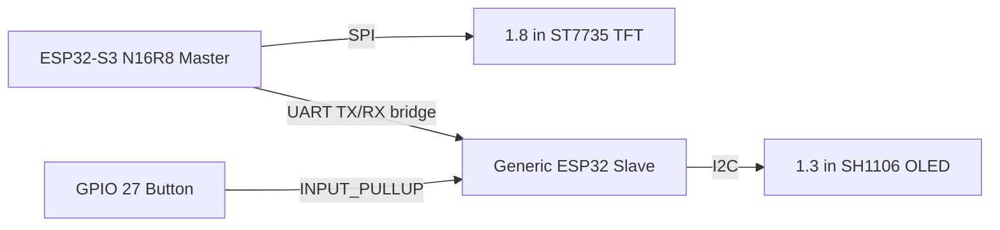

# BruceForce

BruceForce is a compact offensive and defensive wireless security research and network behavior monitoring developer device built around the ESP32 family. It is designed for authorized lab work, protocol inspection, vulnerability validation, and controlled feature development rather than general consumer use.

## What this repo contains

- ESP32-S3 master firmware for the main TFT UI and primary controls
- Generic ESP32 slave firmware for the OLED status/graph co-processor
- Hardware notes, pin mappings, and version logs
- Legacy firmware source retained under the `firmware/` tree while the repo transitions to the BruceForce brand

## Current status

Working today:

- ESP32-S3 N16R8 master with 1.8" ST7735 TFT
- 160x128 landscape UI layout
- 4 physical button navigation
- Generic ESP32 slave with 1.3" SH1106 OLED
- UART bridge for master/slave status exchange

Planned next additions:

- IR transmit/receive hardware support
- NFC / RFID expansion
- Additional Bruce modules and device-specific UI polish

## Hardware overview

### Master node

ESP32-S3 N16R8 specs used by this project:

- Dual-core Xtensa LX7 CPU up to 240 MHz
- 16 MB flash
- 8 MB PSRAM
- 2.4 GHz Wi-Fi and Bluetooth LE
- USB OTG / native USB support on S3-based boards

Role:

- Drives the TFT interface
- Handles the main navigation buttons
- Runs the primary BruceForce UI and radio workflows

### Slave node

Generic ESP32 with:

- 1.3" SH1106 OLED over I2C
- Single GPIO 27 button
- Wi-Fi and Bluetooth disabled for low-power display duty

Role:

- Displays monitoring graphs and status summaries
- Acts as a simple input/output co-processor for the master

### Display hardware

1.8" ST7735 TFT:

- 128 x 160 pixels
- SPI interface
- Landscape mode used in this project

1.3" SH1106 OLED:

- 128 x 64 pixels
- I2C interface

## Wiring guide

### Master ESP32-S3 N16R8 to 1.8" ST7735 TFT

| TFT Pin | Connect to |
| --- | --- |
| VCC | 3.3V |
| GND | GND |
| LED | GPIO21 |
| SCK | GPIO12 |
| SDA / MOSI | GPIO11 |
| A0 / DC | GPIO14 |
| RESET | GPIO15 |
| CS | GPIO10 |
| MISO | GPIO13 or NC if the module does not use readback |

### Master ESP32-S3 buttons

| Button | GPIO |
| --- | --- |
| UP | GPIO40 |
| DOWN | GPIO41 |
| OK | GPIO42 |
| BACK | GPIO39 |

### Master to slave UART bridge

| Signal | Master ESP32-S3 | Generic ESP32 |
| --- | --- | --- |
| TX | GPIO16 | RX |
| RX | GPIO17 | TX |
| GND | GND | GND |

### Generic ESP32 slave to SH1106 OLED

| OLED Pin | Connect to |
| --- | --- |
| VCC | 3.3V |
| GND | GND |
| SCL | GPIO22 |
| SDA | GPIO21 |

### Generic ESP32 slave button

| Button | GPIO |
| --- | --- |
| Single input button | GPIO27 to GND using INPUT_PULLUP |

## Circuit diagram

## Build and flash notes

- Keep the master/slave UART jumpers disconnected while flashing either board over USB.
- Use the same USB serial port that appears in PlatformIO or Arduino IDE.
- If the slave is being used as a co-processor, flash it separately from the master.

## Roadmap

BruceForce is being expanded toward a full authorized security research platform with:

- IR tools
- NFC / RFID tools
- Additional radio modules
- Better cross-device telemetry and UI routing

## License

Released under the MIT License. See [`LICENSE`](/LICENSE).
